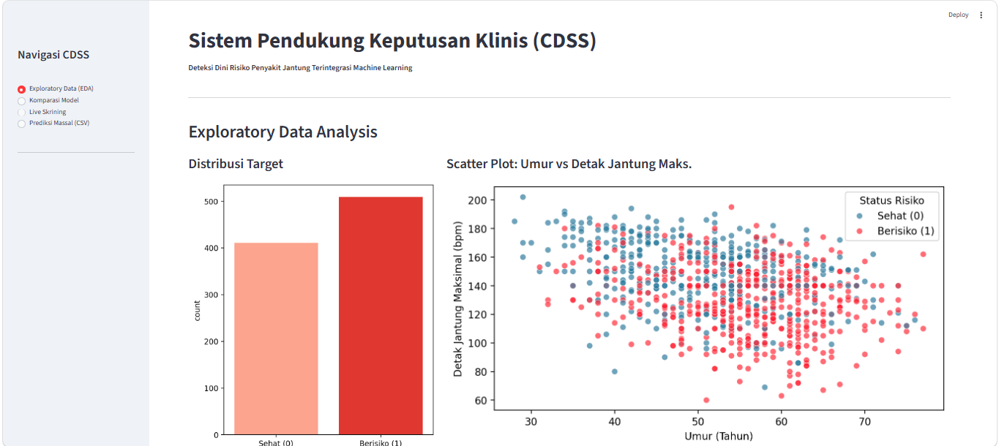
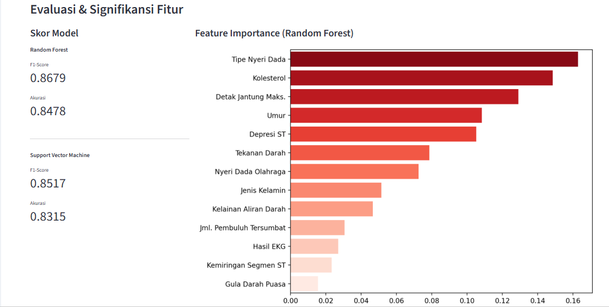
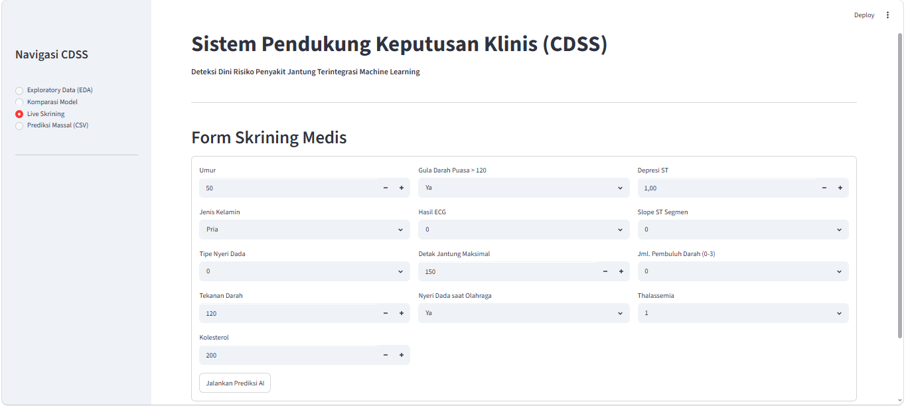
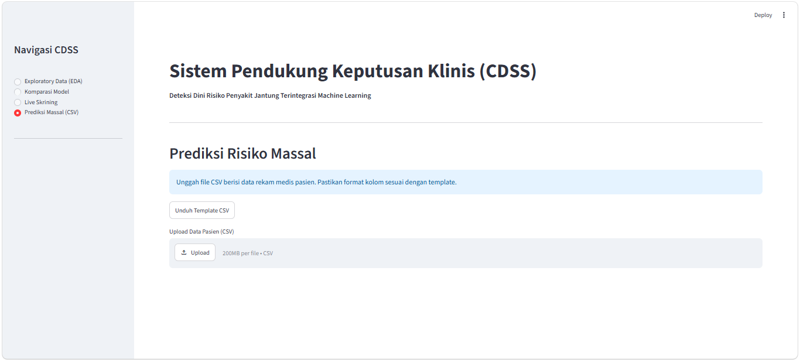

# 🫀 Sistem Pendukung Keputusan Klinis (CDSS)
### Deteksi Dini Risiko Penyakit Jantung Terintegrasi Machine Learning

<div align="center">


**Aplikasi web interaktif berbasis Machine Learning untuk membantu tenaga medis mendeteksi risiko penyakit jantung secara dini.**

</div>

---

## 📋 Daftar Isi

- [Tentang Proyek](#-tentang-proyek)
- [Fitur Utama](#-fitur-utama)
- [Demo Aplikasi](#-demo-aplikasi)
- [Teknologi yang Digunakan](#-teknologi-yang-digunakan)
- [Dataset](#-dataset)
- [Instalasi & Cara Menjalankan](#-instalasi--cara-menjalankan)
- [Struktur Proyek](#-struktur-proyek)
- [Model Machine Learning](#-model-machine-learning)
- [Kontribusi](#-kontribusi)
- [Lisensi](#-lisensi)

---

## Tentang Proyek

**CDSS (Clinical Decision Support System)** adalah sistem pendukung keputusan klinis berbasis web yang dirancang untuk membantu para tenaga medis dan peneliti kesehatan dalam mendeteksi risiko penyakit jantung secara dini.

Aplikasi ini memanfaatkan algoritma **Random Forest** dan **Support Vector Machine (SVM)** yang dilatih menggunakan dataset UCI Heart Disease. Dengan antarmuka yang intuitif, pengguna dapat melakukan:

- Eksplorasi data visual (EDA)
- Komparasi performa model ML
- Skrining risiko pasien secara langsung
- Prediksi massal berbasis file CSV

> **Disclaimer:** Aplikasi ini bersifat edukatif dan tidak menggantikan diagnosis medis profesional. Selalu konsultasikan hasil kepada tenaga kesehatan yang berkompeten.

---

## Fitur Utama

| Fitur | Deskripsi |
|-------|-----------|
| **Exploratory Data Analysis** | Visualisasi distribusi data, scatter plot interaktif, dan preview dataset bersih |
| **Komparasi Model** | Perbandingan performa Random Forest vs SVM beserta feature importance |
| **Live Skrining** | Form input data pasien secara real-time dengan hasil prediksi instan |
| **Prediksi Massal (CSV)** | Upload data rekam medis massal dan unduh hasil prediksi dalam format CSV |

---

## 🖼️ Demo Aplikasi

### 1. Exploratory Data Analysis (EDA)
Visualisasi distribusi data pasien dan hubungan antar variabel klinis.



> Menampilkan distribusi kelas target (Sehat vs Berisiko) dan scatter plot Umur vs Detak Jantung Maksimal yang dipisahkan berdasarkan status risiko pasien.

---

### 2. Komparasi Model & Feature Importance
Evaluasi performa dua model ML beserta visualisasi bobot fitur.



> **Random Forest** mencapai F1-Score **0.8679** dengan akurasi **0.8478**, sedangkan **SVM** mencapai F1-Score **0.8517** dengan akurasi **0.8315**. Fitur paling berpengaruh adalah *Tipe Nyeri Dada*, *Kolesterol*, dan *Detak Jantung Maksimal*.

---

### 3. Form Skrining Medis (Live Prediction)
Input data klinis pasien secara manual untuk mendapatkan hasil prediksi instan.



> Form ini mencakup 13 variabel klinis: Umur, Jenis Kelamin, Tipe Nyeri Dada, Tekanan Darah, Kolesterol, Gula Darah Puasa, Hasil ECG, Detak Jantung Maksimal, Nyeri Dada saat Olahraga, Depresi ST, Slope ST Segmen, Jumlah Pembuluh Darah, dan Thalassemia.

---

### 4. Prediksi Massal via CSV
Upload file CSV berisi data rekam medis banyak pasien sekaligus.



> Mendukung upload file CSV hingga 200MB. Tersedia template CSV yang bisa diunduh agar format kolom sesuai standar model.

---

## Teknologi yang Digunakan

| Teknologi | Kegunaan |
|-----------|----------|
| **Python 3.8+** | Bahasa pemrograman utama |
| **Streamlit** | Framework aplikasi web interaktif |
| **scikit-learn** | Pelatihan model ML (Random Forest, SVM) |
| **Pandas** | Manipulasi dan analisis data |
| **Seaborn / Matplotlib** | Visualisasi data |
| **NumPy** | Komputasi numerik |

---

## Dataset

Proyek ini menggunakan **UCI Heart Disease Dataset** yang terdiri dari data rekam medis pasien dengan **13 fitur klinis**:

| Fitur | Nama Lengkap | Tipe |
|-------|-------------|------|
| `age` | Umur | Numerik |
| `sex` | Jenis Kelamin | Kategorikal (0=Wanita, 1=Pria) |
| `cp` | Tipe Nyeri Dada | Kategorikal (0–3) |
| `trestbps` | Tekanan Darah Istirahat | Numerik |
| `chol` | Kolesterol Serum | Numerik |
| `fbs` | Gula Darah Puasa > 120 mg/dl | Biner |
| `restecg` | Hasil EKG Istirahat | Kategorikal (0–2) |
| `thalach` | Detak Jantung Maksimal | Numerik |
| `exang` | Nyeri Dada saat Olahraga | Biner |
| `oldpeak` | Depresi Segmen ST | Numerik |
| `slope` | Kemiringan Segmen ST | Kategorikal (0–2) |
| `ca` | Jumlah Pembuluh Tersumbat | Kategorikal (0–3) |
| `thal` | Kelainan Aliran Darah | Kategorikal (1–3) |

**Target:** `0` = Sehat, `1` = Berisiko Penyakit Jantung

---

## 🚀 Instalasi & Cara Menjalankan

### Prasyarat
- Python 3.8 atau lebih tinggi
- pip (Python package manager)

### Langkah Instalasi

**1. Clone repository ini**
```bash
git clone https://github.com/Dave0159/CDSS-Heart-Disease.git
cd CDSS-Heart-Disease
```

**2. (Opsional) Buat virtual environment**
```bash
python -m venv venv

# Aktivasi di Windows
venv\Scripts\activate

# Aktivasi di macOS/Linux
source venv/bin/activate
```

**3. Install dependensi**
```bash
pip install streamlit pandas scikit-learn seaborn matplotlib numpy
```

**4. Pastikan file dataset tersedia**

Letakkan file `heart.csv` di direktori root proyek. File ini berisi dataset UCI Heart Disease.

**5. Jalankan aplikasi**
```bash
streamlit run app.py
```

**6. Buka di browser**

Aplikasi akan otomatis terbuka di `http://localhost:8501`

---

## 📁 Struktur Proyek

```
CDSS-Heart-Disease/
│
├── app.py                  # File utama aplikasi Streamlit
├── heart.csv               # Dataset UCI Heart Disease
├── asset/
│   └── screenshot/        # Screenshot antarmuka aplikasi
│       ├── eda.png
│       ├── model_comparison.png
│       ├── live_screening.png
│       └── mass_prediction.png
├── env
└── README.md               # Dokumentasi proyek
```

---

## Model Machine Learning

### Random Forest Classifier
- **Algoritma:** Ensemble learning dengan banyak pohon keputusan
- **F1-Score:** `0.8679`
- **Akurasi:** `0.8478`
- Digunakan sebagai model utama untuk prediksi live dan massal

### Support Vector Machine (SVM)
- **Kernel:** RBF (Radial Basis Function)
- **F1-Score:** `0.8517`
- **Akurasi:** `0.8315`
- Digunakan sebagai model pembanding

### Preprocessing
- **Standardisasi:** `StandardScaler` dari scikit-learn diterapkan pada semua fitur numerik
- **Encoding:** Variabel kategorikal di-encode secara manual sesuai konteks medis
- **Handling Missing Values:** Diisi menggunakan nilai median kolom masing-masing

### Top 5 Fitur Terpenting (berdasarkan Random Forest)
1. Tipe Nyeri Dada (`cp`)
2. Kolesterol (`chol`)
3. Detak Jantung Maksimal (`thalach`)
4. Umur (`age`)
5. Depresi ST (`oldpeak`)

---

## Kontribusi

Kontribusi sangat disambut! Silakan ikuti langkah berikut:

1. **Fork** repository ini
2. Buat **branch** fitur baru (`git checkout -b fitur/fitur-baru`)
3. **Commit** perubahan Anda (`git commit -m 'Tambah fitur baru'`)
4. **Push** ke branch (`git push origin fitur/fitur-baru`)
5. Buat **Pull Request**

---


<div align="center">

Dibuat dengan ❤️ oleh [David Lie Agatha](https://github.com/Dave0159)

⭐ Jika proyek ini bermanfaat, jangan lupa berikan bintang!

</div>
